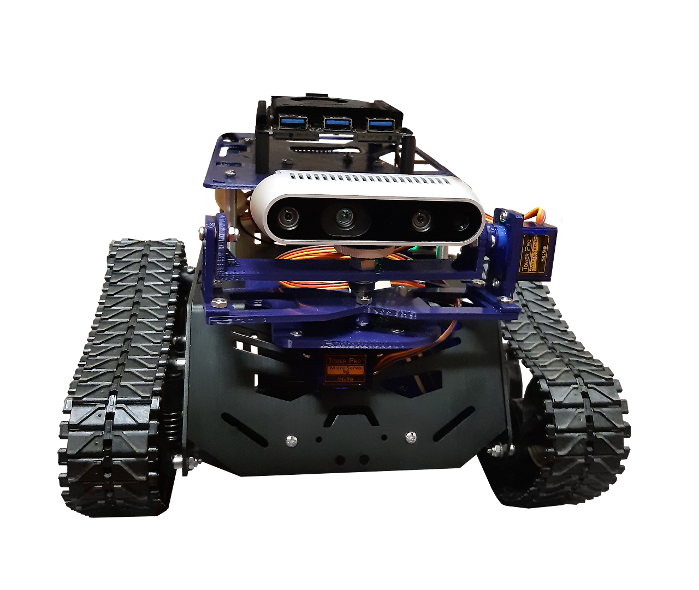

# STREAM Robotics Lab

**Welcome!**

The **AeroSpace AuTonomous Robots with Onboard IntElligent AlgorithMs team (STREAM Robotics Lab)** is part of the Department of Mechanical and Aerospace Engineering at Politecnico di Torino and of the Flight Mechanics Research Team.

Our team is involved on researchs related to Unmanned Aerial Vehicles, Ground Robots and Space systems. The main research topics are real-time guidance and control algorithms for advanced autonomous vehicles and robots, Guidance, Navigation and Control (GNC) algorithms for space proximity operations, design of robust and variable structure controllers for autonomous systems.

## Our Projects

`placeholder`

## Our Robots

The Robots (UGVs and UAVs) employed in our research activities are listed below and their descriptions is found in the `robots` folder.

### UGVs (Unmanned Ground Vehicles)

| Robot Name | Image |
|------------|-------|
| Devastator |  |
| Lynx |  |
| Turtlebot4 |  |

### UAVs (Unmanned Aerial Vehicles)

| Robot Name | Image |
|------------|-------|
| Mavtech RX2 |  |
